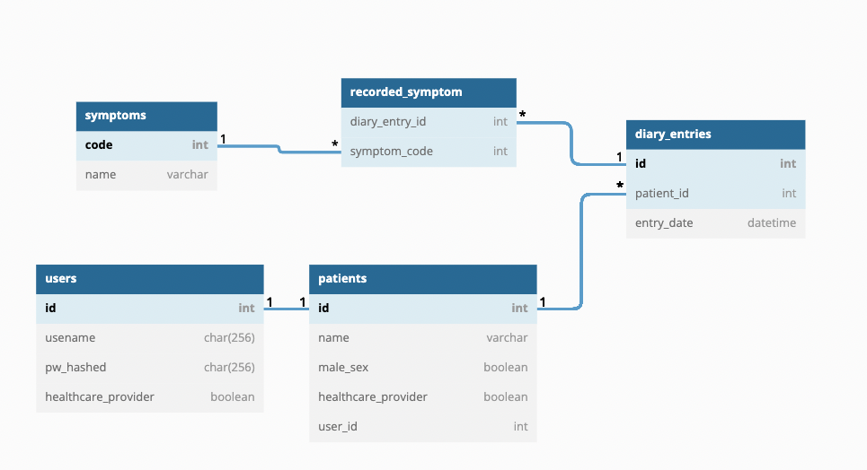

# EndokarditisShinyApp

Variables can be listed by the following command:

    observeEvent(input$submit, {
      output$value <- renderPrint({ input })
    })

Output:

    Datum, Erkrankungen, antibiotika1, antibiotika2, antibiotika3, dateMibi1, daterange1, daterange2, diagnosen, dosis1, dosis2, dosis3, fieber, fremd, fremd1, fremd2, fremd3, fremd4, geschlecht, gewicht, groesse, maligne, maligneFreitext, material1, material2, medis, mibi1, mibi2, patNachname, patVorname, submit, symptome, temp, vorerkrankungen
